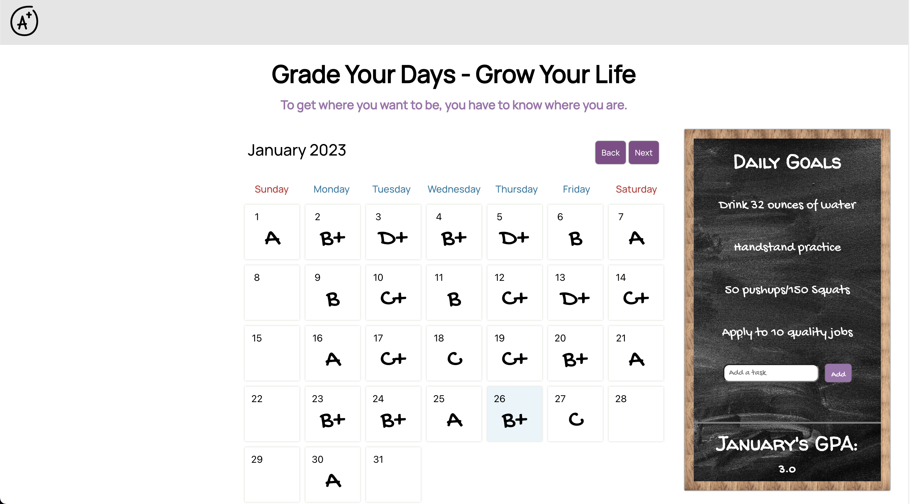

Grade Your Days - Grow Your Life

## Link to App

https://gradeyourdays.herokuapp.com/

## Description

This app was inspired by [this clip](https://www.youtube.com/watch?v=MsZK6eFXW-o&t=233s&ab_channel=IMPAULSIVEClips) I recently saw from Rob Dyrdek on how rating each day of his life improved his self-awareness and productivity because it provided data that could be used to track trends over time which eventually lead to insights about why & how his life is going over all.

This idea was really intriguing to me and I wanted to try it for myself as I've wanted to become more disciplined and consistent about the things that are important to me. I wasn't aware of any apps that were specifically geared towards grading your days so I decided to build one myself.

The basic functionality of the app is as follows:
 - users can add up to 5 daily tasks to a chalkboard as a reminder of the goals they'd like to achieve for each day
 - users can click on any day on a calendar and grade that day subjectively based on how they feel they performed that day with the option to add notes about that particular day
 - users are provided visual feedback at a glance of how they are performing on a month to month basis accompanied by a monthly GPA at the bottom of the chalkboard

 I went back and forth with myself about whether the grading should be subjective based on how the use felt like they performed or if the grading should be objective based on how if they completed the tasks they assigned themselves.

 I decided to keep it subjective for now because they point of this tool is to increase self-awareness and self-accountability. In order to be accountable, you have to be honest with yourself about how you're doing. So leaving the grading subjective gives the user a greater opportunity to hold themselves accountable.

 That being said, you'll notice that you don't have the ability to give yourself an "F" because I wholeheartedly believe that no day is a failure. And if you're willing to use a tool like this to help improve your quality of life, then you're already doing more than most people would to improve your life and that in and of itself is a major success.

 The app was built using React for the front end and local storage for data storage & retrieval.

There are a few more features that I have planned but first I would like to get some users and hear whether or not this is something that people would actually use so that they can help guide development.

## Images

App Landing Page

## Tech Stack
    - React.js
    - Javascript
    - CSS 
    - HTML 
    

## Upcoming Features
- Dark Mode
- A data view with charts and/or other visual feedback tools

